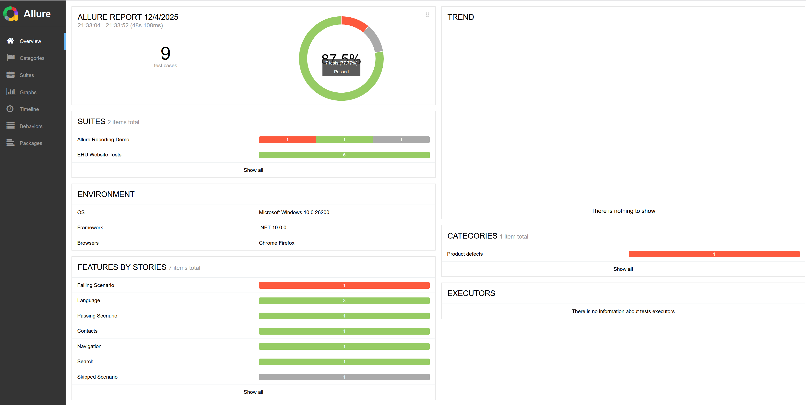

## Инструкция

[Скачать allure-report.zip](allure-report.zip)

## Как открыть отчёт

1. Скачать и распаковать `allure-report.zip`
2. Выполнить команду:

```bash
allure open путь/к/allure-report
```

## Результат



